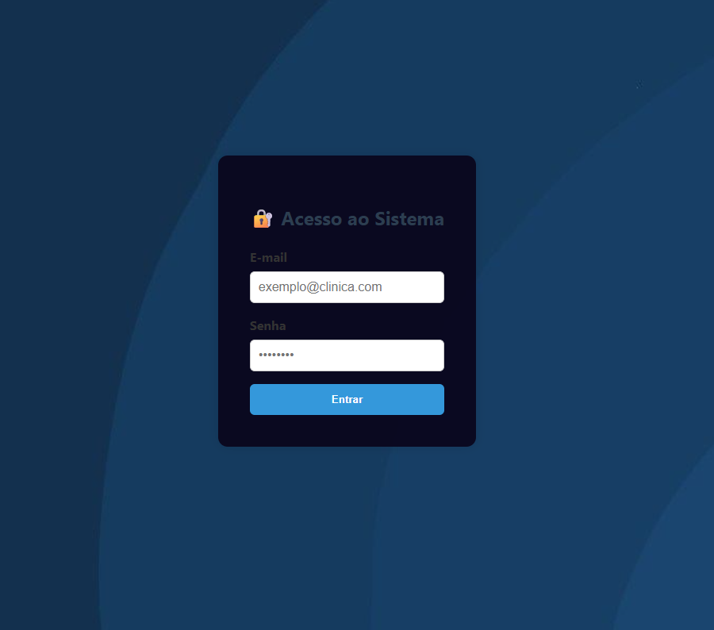
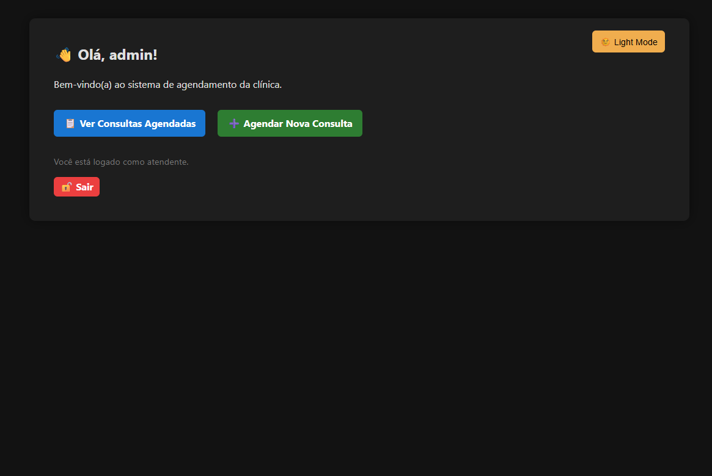
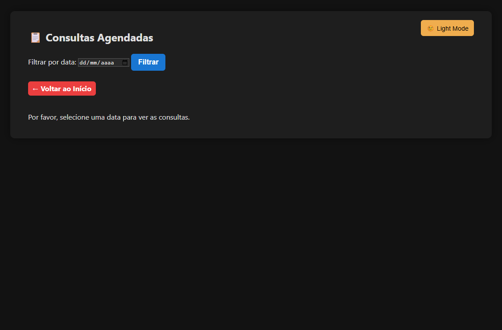

# 🏥 Sistema de Agendamento de Consultas Médicas

Aplicação web desenvolvida com **Flask** e **SQLite** para o gerenciamento de consultas médicas em clínicas. O sistema permite o controle completo de pacientes, médicos, horários e agendamentos, com uma interface moderna, responsiva e suporte a modo escuro.

---

## ✨ Funcionalidades Principais

- 🔐 Login de atendentes com verificação segura
- ➕ Cadastro de pacientes
- 📅 Agendamento de consultas com controle de vagas
- ♻️ Reagendamento e ❌ cancelamento de consultas
- 📄 Emissão de comprovante de agendamento
- 🔍 Filtro de consultas por data
- 🌗 Alternância entre modo claro/escuro (manual e automático)
- ⚠️ Feedback visual com mensagens flash
- 🔄 Atualização dinâmica de horários por médico via JavaScript (fetch)
- 📱 Interface 100% responsiva

---

## 🛠 Tecnologias Utilizadas

- **Backend:** Python 3, Flask, SQLite
- **Frontend:** HTML5, CSS3, JavaScript (fetch)
- **Templating:** Jinja2 (Flask)
- **Autenticação:** Werkzeug (`generate_password_hash`)
- **Servidor de produção:** Gunicorn

---

## 📁 Estrutura do Projeto

/clinica-agendamentos/ <br>
├── app.py<br>
├── requirements.txt<br>
├── templates/<br>
│   ├── login.html<br>
│   ├── home.html<br>
│   ├── agendar.html<br>
│   ├── comprovante.html<br>
│   ├── consultas.html<br>
│   ├── reagendar.html<br>
│   └── cadastro_usuario.html<br>
├── static/<br>
│   ├── style.css<br>
│   ├── login.css<br>
│   └── img/<br>
│       └── fundo_azul.jpg<br>
│       └── fundo_azul.jpg<br>


---

## ▶️ Como Rodar o Projeto Localmente

1. **Clone o repositório:**

```bash
git clone https://github.com/Joa1v-dev/clinica-agendamentos.git
cd clinica-agendamentos

```

2. **Instale as dependências:**

```bash
pip install -r requirements.txt

```

3. **Inicie o servidor local:**

```bash
python app.py

```

4. **Acesse o sistema no navegador**

   *http://localhost:5000*

---

5. **E-mail e Senha para Acesso**

    **E-mail**: `admin@admin`<br>
    **Senha**: `admin`<br>

---

## 🎨 Interface e Estilo

O sistema conta com uma interface moderna e leve, feita com HTML e CSS puro:

- 🌗 Modo escuro automático (via prefers-color-scheme) e manual (via botão com localStorage)
- 🎯 Estilo consistente com botões semânticos (sucesso, erro, alerta)
- 📱 Responsivo para celular, tablet e desktop
- ⚠️ Validação de campos com HTML5 e feedback de erros em destaque
- 🔄 Componentes reativos (horários por médico via JavaScript)

---

## 💻Demonstração das Telas

**Tela de Login** <br><br>
 <br>

**Tela Inicial**<br><br>
 <br>

**Tela de Agendamento**<br><br>
 <br>


---


## 📌 Status do Projeto

🚧 Em desenvolvimento

## 👤 Autor
João Victor Alexandre Oliveira

